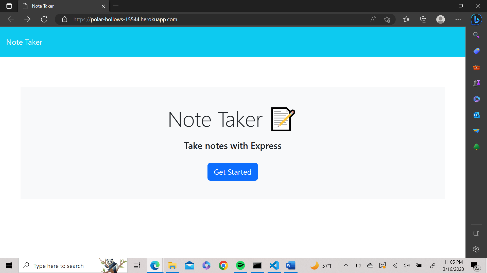

# saveMynotes

## Description

This project is the eleventh challenge assignment for boot camp students. 

This assignment main task is the creation of the back end for an application that can be used to write and save notes. This application will use an Express.js back end and will save and retrieve note data from a JSON file.

## Usage

## Credits

Link to deployed application: https://polar-hollows-15544.herokuapp.com/
link to starter code: https://github.com/coding-boot-camp/miniature-eureka

## License

N/A
